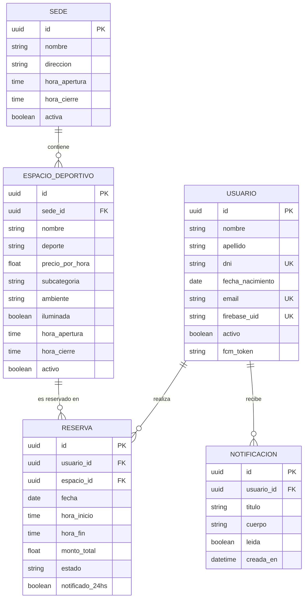

# Modelo de datos — Club Noemi Acosta

Este documento describe las entidades, atributos y relaciones de la
base de datos del proyecto. La base es PostgreSQL, y las tablas se
definen mediante SQLAlchemy en `backend/models.py`.

## Diagrama entidad-relación

## Entidades

### Usuario

Representa a cada persona registrada en la app.

| Atributo | Tipo | Descripción |
|---|---|---|
| `id` | UUID (PK) | Identificador único |
| `nombre` | String | Nombre del usuario |
| `apellido` | String | Apellido del usuario |
| `dni` | String (único) | Documento de identidad |
| `fecha_nacimiento` | Date | Fecha de nacimiento |
| `email` | String (único) | Usado para iniciar sesión |
| `firebase_uid` | String (único, nullable) | UID de la cuenta en Firebase Authentication. Las contraseñas las guarda Firebase, no esta base. Queda en `null` si el usuario dio de baja su cuenta |
| `activo` | Boolean | `false` si el usuario dio de baja su cuenta |
| `fcm_token` | String (nullable) | Token del dispositivo para notificaciones push |

### Sede

Representa un predio físico del club (por ejemplo, "Morón" o "Castelar").

| Atributo | Tipo | Descripción |
|---|---|---|
| `id` | UUID (PK) | Identificador único |
| `nombre` | String | Nombre de la sede |
| `direccion` | String | Dirección física |
| `hora_apertura` | Time | Horario de apertura de la sede |
| `hora_cierre` | Time | Horario de cierre de la sede |
| `activa` | Boolean | Si la sede está operativa |

### EspacioDeportivo

Representa una cancha o espacio deportivo puntual dentro de una sede
(por ejemplo, "Cancha de Fútbol 5 — Cancha 1").

| Atributo | Tipo | Descripción |
|---|---|---|
| `id` | UUID (PK) | Identificador único |
| `sede_id` | UUID (FK → Sede) | Sede a la que pertenece |
| `nombre` | String | Formato: Sede_Dirección_Deporte_Número |
| `deporte` | String | Fútbol, Tenis, Hockey, Vóley, Golf |
| `precio_por_hora` | Float | Precio de la reserva por hora |
| `subcategoria` | String (nullable) | Ej: "Fútbol 5", "Polvo de Ladrillo" |
| `ambiente` | String (nullable) | Outdoor / Indoor |
| `iluminada` | Boolean | Si la cancha tiene iluminación artificial |
| `hora_apertura` | Time (nullable) | Horario propio de la cancha, si difiere del de la sede |
| `hora_cierre` | Time (nullable) | Horario propio de la cancha, si difiere del de la sede |
| `activo` | Boolean | Si el espacio está disponible para reservar |

### Reserva

Representa la reserva de un espacio deportivo por parte de un usuario,
para una fecha y horario determinados.

| Atributo | Tipo | Descripción |
|---|---|---|
| `id` | UUID (PK) | Identificador único |
| `usuario_id` | UUID (FK → Usuario) | Quién hizo la reserva |
| `espacio_id` | UUID (FK → EspacioDeportivo) | Qué cancha se reservó |
| `fecha` | Date | Fecha de la reserva |
| `hora_inicio` | Time | Hora de inicio (siempre en punto) |
| `hora_fin` | Time | Hora de fin (siempre en punto) |
| `monto_total` | Float | Calculado como precio_por_hora × duración |
| `estado` | String | `confirmada` o `cancelada` |
| `notificado_24hs` | Boolean | Si ya se envió el recordatorio push de 24hs antes |

### Notificacion

Historial persistente de notificaciones push enviadas a un usuario
(cancelación de reserva, cancelación por administración, recordatorio
24hs antes).

| Atributo | Tipo | Descripción |
|---|---|---|
| `id` | UUID (PK) | Identificador único |
| `usuario_id` | UUID (FK → Usuario) | Destinatario de la notificación |
| `titulo` | String | Título de la notificación |
| `cuerpo` | String | Texto de la notificación |
| `leida` | Boolean | Si el usuario ya la marcó como leída |
| `creada_en` | DateTime | Fecha y hora en que se generó |

## Relaciones

- **Usuario → Reserva** (1 a N): un usuario puede tener muchas reservas;
  cada reserva pertenece a un único usuario.
- **Usuario → Notificacion** (1 a N): un usuario puede recibir muchas
  notificaciones; cada notificación pertenece a un único usuario.
- **Sede → EspacioDeportivo** (1 a N): una sede tiene muchos espacios
  deportivos; cada espacio pertenece a una única sede.
- **EspacioDeportivo → Reserva** (1 a N): un espacio deportivo puede
  tener muchas reservas a lo largo del tiempo; cada reserva es sobre
  un único espacio.

Todas las claves foráneas están implementadas como UUID, y todas las
tablas usan UUID (en vez de enteros autoincrementales) como clave
primaria, generado automáticamente en el momento de la creación de
cada fila.
